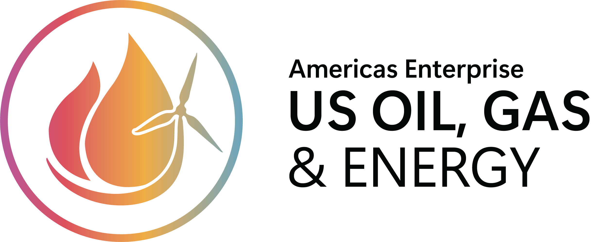

<p align="center">
  
</p>

<h1 align="center">OGE Ops Council</h1>

<p align="center"><strong>Multi-agent operational intelligence for Azure Cloud Operations — Microsoft Oil, Gas & Energy</strong></p>

---

Six AI specialists — each named after cloud operations concepts — debate, disagree, and synthesize to deliver balanced, transparent recommendations. Built for teams that need operational answers without elevated access.

**Two views, one platform:**
- **Reliability** — Executive dashboard with reliability scores, pillar assessments, and service health (Rick's view)
- **Ops Center** — Operational findings, chaos testing, remediation code, and deep intelligence (Christopher/Shane's view)

## The Crew

| | Agent | Role | Model | What They Do |
|--|-------|------|-------|-------------|
| ⚡ | **Pipeline** | Coordinator | foundry-gpt | Routes requests, synthesizes the crew's takes, delivers exec-ready summaries |
| 🛢️ | **Barrel Counter** | Cost | foundry-reasoning | Finds waste, recommends rightsizing, shows the math — every dollar is a barrel |
| 🔧 | **The Roughneck** | Standards | foundry-gpt | Knows *why* things are built the way they are. Writes Terraform remediation. |
| 🔄 | **Turnaround** | Diagnostics | foundry-reasoning | Root cause analysis without users needing elevated access |
| 🔥 | **Flare Stack** | Monitoring | foundry-nano | Proactive scanning — surfaces problems before they become incidents |
| 📋 | **The Inspector** | Compliance | foundry-reasoning | Classifies policy violations as definition bugs, misconfigurations, exemptions, or workaround abuse |

## How It Works

```
User Question  /  🔥 Flare Stack Alert  /  ☀️ Morning Briefing
         │
         ▼
    ⚡ Pipeline (routes to crew)
         │
   ┌─────┼──────────┬──────────┬──────────┐
   ▼     ▼          ▼          ▼          ▼
 🛢️      🔧         🔄         🔥         📋
Barrel  Rough-    Turn-     Flare     The
Counter neck      around    Stack     Inspector
   │     │          │          │
   └─────┴──────────┘          │
        ▼  (Round 2: Debate)   │
   ⚡ Pipeline ◄───────────────┘
        │
        ▼
  Streamed live: each crew member
  speaks → rebuttals → synthesis
  → Generate Terraform / CLI fix
  → Executive Summary
```

**Round 1**: Each specialist gives their styled take (3-5 sentences).
**Round 2**: Each specialist sees the others' takes and argues back (2-3 sentences).
**Round 3**: Pipeline delivers a crisp executive readout.

All responses stream via Server-Sent Events — you watch the crew debate live.

## Key Features

### Executive Reliability View
- Reliability score (0-100) with animated ring gauge
- Four pillar assessments: Security, Governance, Resilience, Cost Efficiency — each with score bars
- Azure Service Health events — clickable for "which of MY resources are affected?"
- Prioritized action cards (HIGH / MED / LOW)
- "Ask Pipeline for Executive Summary" button

### Ops Center
- Real-time findings: orphaned disks, public IPs, insecure storage, NSG drift
- Deep intelligence: architecture smell detection, cross-resource correlation, orphaned NSGs, idle App Service Plans, empty subnets
- Azure Advisor integration — platform-verified evidence alongside crew analysis
- Resource Health status bar with visual progress indicator
- Auto-refresh every 60 seconds in Live mode (Resource Graph queries are free)
- Change detection — badge flashes "⚡ CHANGE DETECTED" when environment changes
- 💥 "Do Something Stupid" chaos demo — creates real security problem, detected in ~10 seconds
- ☀️ Morning Briefing — overnight digest from the crew

### Ops Council Chat
- Streaming multi-agent debate with custom-styled personalities
- 🔧 Generate Terraform / CLI Fix button after every analysis
- 📊 Executive Summary button for leadership-ready output
- Token cost ticker — transparency on every interaction (pennies per query)
- Dynamic suggested questions that update based on real environment scan

### Data Modes
- **Demo**: Pre-built demo scenarios (VM sizing, deployment failure, waste analysis)
- **Live**: Scans real Azure subscription via Managed Identity — everything real

## Architecture

| Component | Technology | Purpose |
|-----------|-----------|---------|
| Frontend | Tailwind CSS (CDN), vanilla JS, SSE | Dashboard + chat UI |
| Backend | Python 3.13 / Flask / Gunicorn | API, scan, agent orchestration |
| Hosting | Azure Web App on P0v3 plan | Shared existing plan |
| AI | Azure OpenAI (6 model deployments across 2 regions) | Agent reasoning and synthesis |
| Data | Resource Graph, Resource Health, Service Health, Advisor, Monitor | Environment intelligence |
| Deep Analysis | Cross-resource ARG queries | Architecture smells, blast radius, correlation |
| Security | VNet, Key Vault (PE), Managed Identity, RBAC | Zero passwords, least-privilege |

**Daily cost: ~$0.15-0.75** (scanning is free; reasoning models cost more per query but deliver better output)

## Quick Start

1. Edit `infra/main.bicepparam` with your values
2. `cd infra && bash deploy.sh`
3. Grant Reader + Log Analytics Reader + Monitoring Reader to the MI
4. Zip deploy: `curl -X POST .../api/zipdeploy` with app code
5. Open the URL and toggle to Live

## RBAC Summary

**5 read-only roles + 1 scoped write on 1 Managed Identity. Zero changes to user permissions.**

| Role | Scope | Purpose |
|------|-------|---------|
| Reader | Subscription | Resource enumeration, health, tags |
| Log Analytics Reader | Subscription | Activity logs, deployment failures |
| Monitoring Reader | Subscription | Metrics, alerts, diagnostics |
| Key Vault Secrets User | Key Vault (resource) | Read secrets only |
| Cognitive Services OpenAI User | OpenAI Accounts (your Azure regions) | Call models across both regions |
| Network Contributor | NSG (resource, demo only) | Chaos demo NSG rule create/delete |

## API Endpoints

| Endpoint | Method | Description |
|----------|--------|-------------|
| `/api/health` | GET | Health check with agent status |
| `/api/scan/overview` | GET | Full scan (Resource Graph + Health + Advisor + Deep) |
| `/api/scan/security` | GET | Quick security drift scan |
| `/api/scan/compliance` | GET | Azure Policy compliance scan + violation classification |
| `/api/ask/stream` | POST | SSE streaming crew debate |
| `/api/demo/<id>/stream` | POST | SSE streaming demo scenario |
| `/api/remediate` | POST | Generate Terraform/CLI fix |
| `/api/digest` | GET | Morning briefing (SSE) |
| `/api/chaos/create` | POST | Create chaos NSG rule |
| `/api/chaos/cleanup` | POST | Remove chaos NSG rule |

## Project Structure

```
├── app/
│   ├── agents/
│   │   ├── demos.py          # 6 demo scenarios with realistic data
│   │   └── runner.py         # Debate system, SSE streaming, remediation
│   ├── azure_data.py         # Resource Graph, Health APIs, Advisor, deep analysis
│   ├── config.py             # Agent configs, custom-styled system prompts
│   └── main.py               # Flask app, all API endpoints
├── infra/                    # Bicep IaC (VNet, KV, identity, web app)
├── templates/index.html      # Executive + Ops views
├── docs/                     # RBAC guide, demo script, architecture, decisions
├── requirements.txt
├── wsgi.py
└── startup.sh
```

## License

Internal use. Not for redistribution.
