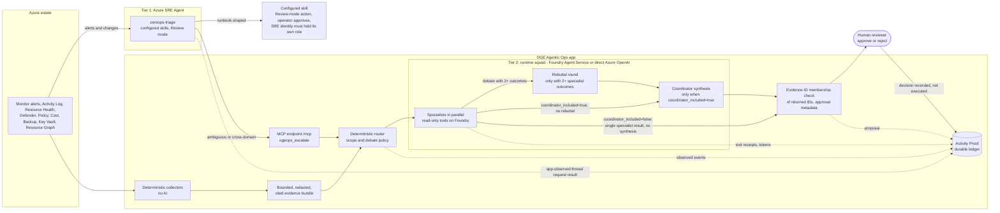

<p align="center">
  
</p>

<h1 align="center">OGE Agentic IT Operations</h1>

<p align="center">
  <strong>Configured as Tier 1, the Azure SRE Agent is meant to triage and stabilize. The OGE squad weighs the trade-offs and records the decision.</strong><br>
  Evidence-grounded, multi-specialist operations intelligence for Azure, with durable proof and human approval.<br>
  <sub>This app observes its own SRE thread requests and the MCP reports it receives. It does not observe provider-side triage or stabilization.</sub>
</p>

<p align="center">
  <a href="LICENSE"></a>
  
  
  
  
</p>

<p align="center">
  <a href="#why-this-exists">Why</a> &middot;
  <a href="#sre-agent-vs-oge-squad-vs-both">Decision table</a> &middot;
  <a href="#how-it-fits-together">Architecture</a> &middot;
  <a href="#scenarios">Scenarios</a> &middot;
  <a href="#proof-not-theater">Proof</a> &middot;
  <a href="#quick-start">Quick start</a> &middot;
  <a href="#documentation-map">Docs</a>
</p>

> **Product naming:** the in-app brand ("Ops Council") comes from the active profile
> (`APP_PROFILE`, default `power`) and is swappable without code changes. See
> [BRANDING.md](BRANDING.md).

---

## Why this exists

Most incidents are not hard. A port was opened, a startup command was changed, a deploy broke the site.
A tier-1 responder with the right runbook should fix those in minutes.

The expensive incidents are the others: the fix touches cost, security, policy and a deadline at once;
nobody agrees on blast radius; the "obvious" revert would break the hotfix that was keeping a customer up.
Those need more than a fast response. They need **evidence, independent perspectives, an auditable
recommendation and a human who can see exactly what was and was not done**.

This repository pairs two things that solve different halves of that problem:

| | Azure SRE Agent | OGE runtime squad |
|---|---|---|
| **Optimizes for** | Speed to triage and stabilization (intended Tier-1 role) | Decision quality and governance |
| **Question it answers** | "What broke, and is there a known safe fix?" | "What are the trade-offs, who owns them, and what should we approve?" |

**Business and operations value** &mdash; the first two are the *intended* outcomes of this design, not a
measured benchmark. The last three are mechanisms you can inspect in the code and in the Activity ledger.

- ⏱️ **Intended: less time investigating from scratch.** Runbook-shaped incidents are meant to stay with the SRE Agent, so they cost no squad tokens.
- 🧭 **Intended: better decisions on ambiguous incidents.** Deterministic evidence, domain specialists and a rebuttal round are designed to surface disagreement instead of hiding it.
- 🧾 **Auditable by design.** Agents are instructed to include relevant finding IDs; every returned evidence ID is checked for membership in the supplied bundle, and unsupported IDs are reported rather than silently dropped. A durable Activity timeline records what the application observed.
- 🛑 **No surprise changes.** The squad is read-only. Approval records a decision; it never executes a fix.
- 💸 **Model spend you can see.** Provider-reported tokens per run, round and agent, plus a caller-maintained cost estimate from the prices you configure.

---

## SRE Agent vs OGE Squad vs Both

The boundary is about **deterministic governance, evidence and decision quality**, not about what either
side is capable of in general.

| Situation | Azure SRE Agent | OGE squad | Both |
|---|:---:|:---:|:---:|
| Alert fires; cause is a single recent reversible change | ✅ Triage and a configured runbook/skill | – | Only if it turns out not to be runbook-shaped |
| Need alert/thread context and Azure-native operational actions in Review mode (operator approves each applicable Azure operation; the SRE Agent identity needs its own write permission) | ✅ | – | – |
| Fix involves cost **and** reliability **and** security/policy trade-offs | Triage and hand-off | ✅ Cross-domain reasoning | ✅ Configured SRE Agent triages, squad weighs |
| Revert may break a hotfix; business impact unclear | Gathers symptoms | ✅ Independent perspectives plus rebuttal | ✅ |
| Deadline plus failed automation (for example a certificate) | Detects and escalates | ✅ Produces a plan and script for human review | ✅ |
| Need a durable, evidence-linked record of **why** a decision was made | Thread history | ✅ Bundle-checked evidence IDs and Activity Proof | ✅ |
| Proactive posture review or morning briefing, no incident open | – | ✅ | – |
| Anything that changes Azure | Review-mode actions, per its own configuration, operator approval and its own identity's permissions | ❌ Never. Proposal plus human approval | Human approves consequential actions |

| | **Azure SRE Agent** | **OGE runtime squad** |
|---|---|---|
| **Role in this repo** | Tier 1 | Tier 2 |
| **Trigger** | Azure Monitor alert response plan, scheduled task, chat | `ogeops_escalate` over MCP, or an operator in the app |
| **Evidence** | What the agent queries during triage (provider-side; not observable from this app) | 14 deterministic Phase 1/2 collectors plus 8 legacy-scan source envelopes, bounded and cited |
| **Reasoning** | One triage agent | Routed specialists, coordinator synthesis when routed, rebuttal only when 2+ specialist outcomes exist |
| **Output** | Thread, triage, runbook action | Conclusion with any returned finding IDs, business impact, ranked actions, remediation draft, proposal |
| **Cost basis** | Azure Agent Units (this app shows a hypothetical task-profile estimate) | Provider-reported Foundry/Azure OpenAI tokens × the prices you configure |

**Combined model:** the SRE Agent is configured as Tier 1 to triage and stabilize; the squad handles
ambiguity, trade-offs and the durable decision. Humans keep approval for anything consequential.

> [!NOTE]
> The SRE Agent column describes **configured and intended** provider behavior. This repository ships the
> custom agent, skills, response plan and MCP connector definitions; it observes its own thread-request
> results and the MCP reports it receives. Provider-side investigation, skill/runbook selection and any
> Azure action happen outside this application and are **not independently verified here**.

---

## How it fits together


```mermaid
flowchart LR
    subgraph AZ["Azure estate"]
        SRC["Monitor alerts, Activity Log, Resource Health,<br/>Defender, Policy, Cost, Backup, Key Vault, Resource Graph"]
    end

    subgraph T1["Tier 1: Azure SRE Agent"]
        SRE["zeroops-triage<br/>configured skills, Review mode"]
    end

    subgraph APP["OGE Agentic Ops app"]
        MCP["MCP endpoint /mcp<br/>ogeops_escalate"]
        COL["Deterministic collectors<br/>no AI"]
        EV["Bounded, redacted,<br/>cited evidence bundle"]
        RT["Deterministic router<br/>scope and debate policy"]
        subgraph SQ["Tier 2: runtime squad - Foundry Agent Service or direct Azure OpenAI"]
            SP["Specialists in parallel<br/>read-only tools on Foundry"]
            RB["Rebuttal round<br/>only with 2+ specialist outcomes"]
            SY["Coordinator synthesis<br/>only when coordinator_included=true"]
        end
        VAL["Evidence-ID membership check<br/>of returned IDs, approval metadata"]
        ACT[("Activity Proof<br/>durable ledger")]
    end

    HUM(["Human reviewer<br/>approve or reject"])

    SRC -->|"alerts and changes"| SRE
    SRC --> COL
    SRE -->|"runbook-shaped"| RUN["Configured skill<br/>Review-mode action, operator approves,<br/>SRE identity must hold its own role"]
    SRE -->|"ambiguous or cross-domain"| MCP
    MCP --> RT
    COL --> EV --> RT
    RT --> SP
    SP -->|"debate with 2+ outcomes"| RB --> SY
    SP -->|"coordinator_included=true, no rebuttal"| SY
    SP -->|"coordinator_included=false:<br/>single specialist result, no synthesis"| VAL
    SY --> VAL
    VAL --> HUM
    HUM -->|"decision recorded, not executed"| ACT
    RT -.->|"observed events"| ACT
    SP -.->|"tool receipts, tokens"| ACT
    VAL -.->|"proposal"| ACT
    SRE -.->|"app-observed thread request result"| ACT
```

1. **Collect** &mdash; deterministic collectors turn Azure signals into cited findings. No model is involved.
2. **Route** &mdash; code (not a model) picks the specialists and decides whether the debate flow (coordinator synthesis, plus a rebuttal round when possible) applies.
3. **Analyze** &mdash; specialists reason in parallel over their bounded evidence bundle. On the Foundry backend they may also call the read-only tool registry; the direct backend analyzes the supplied bundle without tool calls.
4. **Challenge** &mdash; when a debate runs and at least two specialist outcomes exist, each specialist rebuts the others. With one specialist outcome there is no rebuttal.
5. **Check evidence IDs** &mdash; the final answer is the coordinator's synthesis when `coordinator_included=true`, otherwise the single specialist's result. Agents are instructed to include relevant finding IDs. Any returned IDs are checked for membership in the supplied evidence bundle; IDs that are not in the bundle are returned as `unsupported_evidence_ids` rather than dropped. An empty ID list still passes schema validation. This is an ID-membership check, not a claim-by-claim fact check of the narrative text.
6. **Approve** &mdash; remediation is a reviewable proposal. A human decision is recorded; nothing is auto-executed.

The debate flow is selected deterministically in `app/agents/routing.py`. Automatic routing enables it when
the evidence spans two or more specialist domains, any matched finding is high/critical severity, any
matched finding is customer-impacting, or the evidence spans three or more domains. High/critical or
customer-impacting evidence in a single domain adds coordinator reasoning, but a **rebuttal round runs only
when at least two specialist outcomes exist** (`app/agents/analysis.py`), so not every high-severity request
produces a rebuttal. Explicit agent selection **overrides** automatic specialist selection: passing multiple
agent keys or `debate=true` requests the debate flow, while a single explicit agent key without
`debate=true` suppresses automatic multi-agent debate. Routine single-domain, low-severity findings go to
one specialist, with the coordinator added only when there is more than one finding to synthesize
([routing policy](docs/AGENT_INTELLIGENCE.md)).

---

## Scenarios

Five ZeroOps demo scenarios (**More → ZeroOps**) show where each tier earns its keep; the last row is the
squad's standalone mode. The scenarios exist for **configured trusted or sandbox deployments**: their
inject/cleanup/escalate controls are `POST` routes, so `PUBLIC_DEMO_MODE=true` intentionally returns `403`
for them and the public site is read-only. Break/fix actions only run when `ZEROOPS_CHAOS_ENABLED=true`
against `ZEROOPS_DEMO_*` resources.

| | Scenario | Path | What breaks | Outcome |
|---|---|---|---|---|
| 🚪 | **Open Door** | SRE only | NSG rule allows SSH from `*` | Single reversible change with a configured runbook/skill. In the demo, a fast probe detects it in seconds; the app requests an SRE Agent thread. **No squad tokens spent.** |
| 💥 | **Bad Deploy** | SRE only | Startup command broken, site down | Revert-shaped fix. Same hand-off, same zero squad cost. |
| ⛈️ | **Storm Surge** | SRE + squad | Plan panic-scaled from B1x1 to P0v3x3 | Cost vs SLO vs right-size is a trade-off, not a revert. Squad weighs it with Cost & Capacity, Incident & Change and Resilience & Hygiene. |
| 🩹 | **Rogue Hotfix** | SRE + squad | Hotfix enabled public blob access and TLS 1.0 | Reverting may break the hotfix. Squad weighs security against availability with Security, Policy and Resilience specialists. |
| ⏰ | **2 AM Certificate** | SRE + squad | Secret expires in 48 h **and** the renewal runbook failed | Deadline plus failed automation: the squad produces a renewal plan and script **for human review**. It does not renew the certificate and does not guarantee the deadline is met. |
| 🗂️ | **Posture review / Morning briefing** | Squad only | No incident open | Prioritized, cited view of backup, patching, policy, monitoring gaps and capacity risk, with an honest list of what could not be seen. |

> [!NOTE]
> Escalated scenarios pin an `expected_agents` set so demos stay deterministic. The SRE custom agent,
> skills and response plan in this repo are templates and configuration — not proof that a provider
> selected or ran them.
> Full scenario, probe and demo-script detail: [docs/ZEROOPS_SRE_AGENT.md](docs/ZEROOPS_SRE_AGENT.md).

---

## Proof, not theater

**Agent Activity** (inside Operations Center) shows what the application *recorded*, so proof does not
depend on opening the Azure, Foundry or SRE portals. Nothing is inferred; no steps, dialogue or reasoning
are synthesized, and there is no raw-reasoning viewer. The public read APIs serve an **allowlisted,
sanitized projection** — the fields below are what that projection can expose. Anything outside the
allowlist (prompts, raw provider payloads, model/deployment names, finish reasons, provider response IDs,
scripts, resource and subscription IDs) is filtered out and is **not** part of public Activity Proof.

| You can see | Where it comes from | Label |
|---|---|---|
| Ascending event timeline per investigation (`seq`, `occurred_at`, `actor`, `kind`, `provenance`) | Durable, append-only events in `OPERATIONS_STATE_DB` | Observed |
| Investigation `origin`, `phase`, optional `scenario_id` / `escalation_id` | Investigation record | Observed |
| **Requested** backend and **actual_backend** (`foundry_agent_service` or `direct_azure_openai`) | `requested_backend` is recorded when the run starts. `actual_backend` is taken from observed model completions. On a failed run with no observed completion it can instead be the backend that was *attempted*, and it is `none` for `insufficient_evidence`. It is not proof of a successful completion; read it with the run `status` | Observed |
| Run `status`, `trigger`, `started_at` / `completed_at` | Run record | Observed |
| Local tool calls | One receipt per call: tool name, round, status, duration, result count (no arguments, output or resource IDs). Duration is available on these tool receipts only | Observed |
| `total_tokens`, `model_calls` — plus `estimated_cost_usd` | Run usage. Tokens are provider-reported; cost is a caller-maintained estimate (see below). Run-level `duration_ms` is not part of the public run/usage list | Observed |
| Citations | Finding IDs that passed the evidence-bundle membership check | Observed |
| SRE thread request | This app's **observed request result** and, when it is a safe opaque value, the returned `thread_id` and status | Observed (request result) / Reported (hand-off opened) |
| MCP escalation received | Caller-supplied fields, as reported to this app | Reported |
| Proposal created | `proposal_created` receipt written when the app creates the proposal | Observed |
| Human approval | `decision_recorded` with `decision: approve` | Approved |
| Human rejection or operator closure | `decision_recorded` with `decision: reject` / `resolve` | Reported |
| Demo fixtures | Hand-authored data | Simulated |

`executed` and `verified` exist in the provenance vocabulary but are **not writable** in this release, so
no Activity record can claim execution or verification.

**Approved is not executed. Executed is not verified.**

| State | Meaning | Implemented today |
|---|---|---|
| `approved` | A human approval was recorded | ✅ Does **not** execute a fix |
| `rejected` | A human rejection was recorded — a decision record only | ✅ |
| `closed_unverified` | An operator closed it — a closure record only | ✅ Not SRE or provider verification |
| `executed` / `verified` | A returned execution or verification receipt | Reserved vocabulary. Producers reject these values in this release, so the UI shows "No execution or verification observed" |

Other honest states: no matching evidence finishes as `insufficient_evidence` (no invented zero-cost
run), invalid coordinator output as `invalid_output`, provider errors as `failed`. A created SRE thread
is an app-observed request result, not evidence of provider triage or remediation. Configured is not connected.

**Tokens are measured; cost is an estimate.** Every grounded run of `/api/operations/analyze` and
`/api/operations/briefing` returns a `usage_summary`: provider-reported prompt/completion/total tokens,
model calls, per-round and per-agent tokens, and tokens per cited finding. `estimated_cost_usd` is **not**
provider-reported — it is computed locally as `tokens × your configured per-agent prices`. Those prices
default to `0.0`, so an unconfigured profile reports `estimated_cost_usd: 0.0`, which means *no pricing is
configured*, **not** that the run was free. Set `input_cost_per_million` / `output_cost_per_million` per
agent to populate it, and treat Azure Cost Management as billing truth. Legacy chat (`/api/ask/stream`,
`/api/demo/<id>/stream`, `/api/remediate`, `/api/digest`) reports per-call usage and does **not** produce a
`usage_summary`.

Details: [Activity Proof API](docs/OPERATIONS_API.md), [UI semantics](docs/UI_WORKFLOW.md),
[Foundry execution proof](docs/FOUNDRY_ARCHITECTURE.md).

---

## The runtime squad

One coordinator and five specialists. Display names, roles and models come from the active profile
(shown for the default `power` profile); keys are stable identifiers. Generated from
`app/agents/catalog.py` into [docs/AGENTS.md](docs/AGENTS.md) and served at `GET /api/agents`.

| | Agent | Key | Owns finding categories | Model (`power`) |
|---|---|---|---|---|
| ⚡ | **Operations Coordinator** | `orchestrator` | Synthesis of all specialists | `gpt-5.6-sol` |
| 💰 | **Cost & Capacity Analyst** | `cost_sentinel` | Cost & budgets, capacity & quota | `gpt-5.6-terra` |
| 🔍 | **Incident & Change Investigator** | `diagnostics_sre` | Incidents & alerts, reliability & SLOs, recent changes | `gpt-5.6-sol` |
| 🛡️ | **Security & Monitoring Analyst** | `scout` | Security posture, monitoring coverage | `gpt-5.6-luna` |
| 📋 | **Policy & Governance Advisor** | `compliance_inspector` | Policy compliance & retirements, ownership & tagging | `gpt-5.6-terra` |
| 🔧 | **Resilience & Hygiene Engineer** | `standards_architect` | Backup, patching, certificate & secret expiry, automation jobs | `gpt-5.6-terra` |

Six read-only tools &mdash; `get_executive_brief`, `list_prioritized_findings`, `get_finding_evidence`,
`get_capacity_watch`, `get_recent_changes`, `get_source_coverage` &mdash; are a **Foundry-backend
capability**. On `AGENT_BACKEND=foundry` each specialist is a versioned Azure AI Foundry agent named
`<FOUNDRY_AGENT_PREFIX>-<key>-<schema>`, the registry is offered to every agent (`FOUNDRY_ENABLE_TOOLS`,
default `true`), and calls are executed locally under a server-bound scope. The default `direct` backend
calls Azure OpenAI chat completions and performs grounded analysis over the supplied evidence bundle
**without tool calls**.

---

## Guardrails

| Guardrail | How it is enforced |
|---|---|
| **Read-only squad tools (Foundry backend)** | Only the registry in `app/agents/tools.py`. No generic ARM, KQL, shell or HTTP tool. `subscription_ids` and `force_refresh` are stripped from the model-facing schema and bound server-side. The direct backend exposes no tools at all. |
| **Deterministic scope and routing** | `app/agents/routing.py` and `app/agents/evidence.py` are plain Python. A model never chooses specialists or subscriptions. |
| **No auto-execution** | Analysis actions carry approval metadata with `auto_executable: false`; production writes are always human-approved (`app/approval.py`). |
| **Evidence IDs checked against the bundle** | Agents (and the coordinator, when routed) are instructed to include relevant finding IDs. Each returned ID is split into `valid_evidence_ids` / `unsupported_evidence_ids` by membership in the supplied bundle, and unsupported IDs are surfaced, never silently dropped. Schema-invalid output is reported, not trusted. This checks the **IDs**, not each sentence of the narrative. |
| **Bounded and redacted** | Evidence bundles, tool output and tool rounds are capped (`FOUNDRY_MAX_TOOL_ROUNDS`, `FOUNDRY_MAX_TOOL_OUTPUT_CHARS`). Public activity projections are allowlisted and sanitized. |
| **Human approvals** | Proposals (Azure DevOps work item or PR, Terraform/CLI draft) need a person. This app never hands a squad script to the SRE Agent for execution; its MCP tools create escalations and proposals and read results — none of them performs an Azure change. |
| **Sanitized public demo** | `PUBLIC_DEMO_MODE=true` is a server-enforced, deny-by-default gate: fixtures and Activity reads only; live, raw and mutating APIs return `403`. |

> [!WARNING]
> `PUBLIC_DEMO_MODE` is **not** operator authentication, Easy Auth or RBAC. It defaults to `false`.
> `/mcp` keeps its own `MCP_API_KEY` (503 while unset); use a long random key from Key Vault and add edge
> rate limiting for real public exposure. See [docs/PUBLIC_DEMO_SECURITY.md](docs/PUBLIC_DEMO_SECURITY.md).

---

## What you get in the product

Two primary views, plus secondary views under **More** ([docs/UI_WORKFLOW.md](docs/UI_WORKFLOW.md)).

| View | Purpose |
|---|---|
| **Executive Brief** | One-sentence status, freshness and source coverage (`N/M sources OK`), Business Impact, Reliability/SLO and Capacity cards, What Changed, Decisions/Escalations, Attention Items. Every value is evidence-backed via `/api/operations/brief`. A missing or errored source is shown as `not_configured` or `unknown`, never as healthy. One button generates a single coordinator-voice briefing. |
| **Operations Center** | Priority-ranked findings queue, shift-handoff bar, finding evidence drawer with acknowledge/assign/start/resolve/dismiss/snooze controls (reasons and expiry required, API errors shown inline), **AI Analyze** with routing explanation, citations, confidence, missing evidence and approval tier, and **Agent Activity**. |
| **ZeroOps** (More) | Tier split, five demo scenarios (inject/escalate controls require a trusted deployment; `403` under `PUBLIC_DEMO_MODE`), fast detection, escalation timeline with *Record approval (does not execute)*, and per-incident cost (hypothetical SRE AAU estimate kept separate from the squad's provider-reported tokens). |
| **Ops Council** (More) | Streaming multi-agent debate, Terraform/CLI fix generation, executive summary, demo scenarios. Legacy chat runs direct-model analysis and is not necessarily Foundry. |
| **Agent Squad** (More) | What each agent does and how, from `/api/agents`. Labeled "Configured runtime (catalog, not proof of a run)". |

**Data modes.** *Demo* serves a centralized fixture (`GET /api/operations/demo`) that passes hand-authored
evidence through the same prioritization/brief/queue/handoff logic as live data; narrative AI strings are
always flagged `"simulated": true`. *Live* scans your subscriptions with Managed Identity. Demo and Live are
never visually ambiguous.

---

## Quick start

1. `python3 scripts/configure.py` &mdash; interactive setup wizard; generates `.env` and
   `infra/main.bicepparam` (both git-ignored) from your answers.
2. Deploy your model deployments in Azure AI Foundry (see [DEPLOYMENT.md](DEPLOYMENT.md)).
3. `cd infra && bash deploy.sh` &mdash; deploys the Bicep infrastructure.
4. Grant Reader + Log Analytics Reader + Monitoring Reader to the Managed Identity, and add
   **Cost Management Reader** per subscription if you enable the Cost Management collectors
   (`cost_management_budget`, `cost_management_trend` — they need
   `Microsoft.CostManagement/query/action`, which Reader does not include)
   (see [DEPLOYMENT.md](DEPLOYMENT.md) / [docs/rbac-implementation-guide.md](docs/rbac-implementation-guide.md)).
5. Zip deploy the app code, open the URL, and toggle to Live. Verify with `GET /api/health`.

Run locally with `python3 wsgi.py` (reads `.env`; telemetry stays off unless configured). Full step-by-step
guide: [DEPLOYMENT.md](DEPLOYMENT.md). Branding, agents and prompts: [BRANDING.md](BRANDING.md).

<details>
<summary><strong>Enable the Foundry backend</strong></summary>

`AGENT_BACKEND` defaults to `direct`. `foundry` is an operator choice, not an automatic failure fallback —
there is no automatic Foundry-to-direct failover; a Foundry run that fails is recorded as `failed`.

| Variable | Default | Purpose |
|---|---|---|
| `AGENT_BACKEND` | `direct` | `foundry` to publish and call versioned Foundry agents |
| `FOUNDRY_PROJECT_ENDPOINT` | none | `https://<account>.services.ai.azure.com/api/projects/<project>` (required for `foundry`) |
| `FOUNDRY_AGENT_PREFIX` | `oge-ops` | Agent name prefix (use per-environment prefixes to share a project) |
| `FOUNDRY_ENABLE_TOOLS` | `true` | Expose the read-only tool registry |
| `FOUNDRY_MAX_TOOL_ROUNDS` | `4` | Tool loop bound |
| `ANALYSIS_MAX_PARALLEL_SPECIALISTS` | `4` | Fan-out width; `1` is sequential |

Bicep: `agentBackend`, `foundryMode` (`none` / `existing` / `new`), `foundryProjectEndpoint`,
`foundrySettings`. Terraform: [`infra/terraform/foundry/`](infra/terraform/foundry/README.md). The identity
needs **Foundry User** on the Foundry account. Details: [docs/FOUNDRY_ARCHITECTURE.md](docs/FOUNDRY_ARCHITECTURE.md).
</details>

<details>
<summary><strong>Connect the Azure SRE Agent (ZeroOps)</strong></summary>

```bash
# Example placeholders — replace the quoted values with your own.
KV_NAME="my-ops-keyvault"
SRE_RG="my-sre-rg"
SRE_NAME="my-sre-agent"
APP_URL="https://my-ops-app.azurewebsites.net"

# 1. Generate ONE secret and keep it in a shell variable (never echo or commit it).
#    The same value is stored in Key Vault and given to the SRE Agent below.
MCP_KEY="$(openssl rand -hex 32)"
az keyvault secret set --vault-name "$KV_NAME" -n mcp-api-key --value "$MCP_KEY" --output none

# 2. Deploy the app with zeroopsSettings: { mcpApiKeySecretName: 'mcp-api-key' }
#    (or a Key Vault reference) so the app's MCP_API_KEY setting resolves to that same secret.

# 3. Configure the SRE Agent (idempotent; DRY_RUN=1 previews the request bodies).
export SRE_AGENT_RESOURCE_GROUP="$SRE_RG" SRE_AGENT_NAME="$SRE_NAME" \
       OGE_APP_URL="$APP_URL" MCP_API_KEY="$MCP_KEY"
./sre-agent/scripts/configure-sre-agent.sh

unset MCP_KEY MCP_API_KEY
```

`MCP_API_KEY` is the shared secret for this app's `/mcp` endpoint, sent by the SRE Agent as the
`X-API-Key` header. The **same value** must be the app's `MCP_API_KEY` setting and the key the connector
uses. While it is unset, `/mcp` returns `503`; a wrong value returns `401`.

The script creates or updates the `ogeops` MCP connector, three skills, the `zeroops-triage` custom agent,
the `zeroops-response` response plan (alert titles containing "ZeroOps", `agentMode: Review`) and an
optional weekday sweep (`SKIP_SCHEDULED_TASK=1` to skip). These are **configuration this repo ships** — the
provider decides at runtime what it actually does, and Review mode means an operator approves each
applicable Azure operation (approval does not grant RBAC; see below).

Optional demo resources live in `infra/zeroops-demo/`; set `ZEROOPS_CHAOS_ENABLED=true` **only** in demo
environments. For fast-detection SRE thread requests also set `SRE_AGENT_ENDPOINT` and grant the **app
identity** **SRE Agent Standard User** *on the SRE Agent resource only* — without it the hand-off reports
`not_configured`. That role only lets the app call the SRE Agent API and create threads; it grants no
Azure write access to anyone.

**Two separate identities.** The app identity's roles (above) are separate from the **Azure SRE Agent's own
identity**. Review mode means an operator approves each applicable Azure operation, but approval does not
grant RBAC. For an approved Azure write to succeed, the SRE Agent identity needs its own separately scoped
write role on the target (for example Contributor on the managed demo resource group or resource) or an
authorized on-behalf-of (OBO) path, in addition to operator approval. The demo template grants the SRE Agent
identity read-only roles by default; exact roles vary by deployment, so see
[docs/ZEROOPS_SRE_AGENT.md](docs/ZEROOPS_SRE_AGENT.md).
Full guide: [docs/ZEROOPS_SRE_AGENT.md](docs/ZEROOPS_SRE_AGENT.md), assets: [`sre-agent/`](sre-agent/README.md).
</details>

<details>
<summary><strong>Public demo mode</strong></summary>

Set `PUBLIC_DEMO_MODE=true` (Bicep: `publicDemoMode`, default `false`) to expose only pages, `/api/health`,
`/api/agents`, `/api/demos`, `/api/operations/demo`, `/api/activity[/<id>]` and `/mcp` (its own API key).
Every other `/api/*` path returns `403`, and **all** non-`GET`/`HEAD`/`OPTIONS` API requests return `403` —
including the ZeroOps scenario `inject` / `cleanup` / `escalate` controls. That is intentional: the live
scenario controls are meant for trusted or sandbox deployments, so a public deployment is read-only and
fixture-backed by design.

To check a deployment's gate yourself, run the commands below against your own URL. Expected behavior with
`PUBLIC_DEMO_MODE=true`: the page and `/api/activity` return `200`, `/api/health` reports
`public_demo_mode` as `true`, and any non-allowlisted path (for example `/api/scan/overview`) or any `POST`
returns `403`. This documents intended gate behavior; it is not an availability or uptime commitment.

```bash
APP_URL="https://my-ops-app.azurewebsites.net"   # placeholder: use your own deployment
curl -s -o /dev/null -w '%{http_code}\n' "$APP_URL/"                            # expect 200
curl -s -o /dev/null -w '%{http_code}\n' "$APP_URL/api/activity"                # expect 200
curl -s "$APP_URL/api/health" | grep -Eo '"public_demo_mode": ?[a-z]+'           # expect true
curl -s -o /dev/null -w '%{http_code}\n' "$APP_URL/api/scan/overview"           # expect 403
curl -s -o /dev/null -w '%{http_code}\n' -X POST "$APP_URL/api/remediate"       # expect 403
```

See [docs/PUBLIC_DEMO_SECURITY.md](docs/PUBLIC_DEMO_SECURITY.md).
</details>

<details>
<summary><strong>Configuration and customization</strong></summary>

Branding, agent names/personalities, prompts, model deployments and per-agent endpoint routing are
controlled by the **profile system** (`profiles/<id>/`) plus environment variables. No code changes needed.
Profiles in this repo: `power` (default, generic power and utilities on a GPT-5.6 Sol/Terra/Luna tier),
`generic` (neutral starting point) and `oge` (legacy example). See [BRANDING.md](BRANDING.md).

| Want to... | Do this |
|---|---|
| Rebrand for a new customer | `python3 scripts/configure.py` and create a new profile (clones `profiles/generic/`) |
| Change an agent's name/role/model | Edit `profiles/<id>/profile.json` |
| Change an agent's system prompt | Edit `profiles/<id>/prompts/<agent_key>.txt` |
| Cap tokens/cost, set tone, or estimate spend per agent | `max_completion_tokens` / `max_context_chars` / `response_instruction` / pricing fields, see [docs/MODEL_CONFIGURATION.md](docs/MODEL_CONFIGURATION.md) |
| Route one agent to a different endpoint/deployment | `AGENT_<KEY>_ENDPOINT` / `AGENT_<KEY>_DEPLOYMENT` (env var), or `agentOverrides` (Bicep) |
| Switch the active profile | `APP_PROFILE` (env var) / `appProfile` (Bicep param) |
| Enable/inspect telemetry | `APPLICATIONINSIGHTS_CONNECTION_STRING`, see [docs/TELEMETRY.md](docs/TELEMETRY.md) |
| Regenerate agent docs after catalog edits | `.venv/bin/python3 scripts/generate_agent_docs.py` (`--check` is tested) |
</details>

<details>
<summary><strong>Identity and RBAC summary</strong></summary>

One user-assigned Managed Identity. **No keys for Azure service authentication** — every Azure data call
uses Entra tokens from that identity, not connection strings or account keys. This is not a claim that the
system uses no secrets at all: `/mcp` has its own `MCP_API_KEY` shared secret (store it in Key Vault), and
optional integrations you configure may carry their own credentials.

Subscription roles are read-only and granted per monitored subscription; user permissions are not changed.

| Role | Scope | Purpose |
|---|---|---|
| Reader | Subscription | Resource enumeration, health, tags |
| Log Analytics Reader | Subscription | Activity logs, deployment failures |
| Monitoring Reader | Subscription | Metrics, alerts, diagnostics |
| Cost Management Reader | Subscription | **Required** for the `cost_management_budget` and `cost_management_trend` collectors (`Microsoft.CostManagement/query/action`); Reader alone returns `403`. Not assigned by `subscription-rbac.bicep` — grant it yourself when cost collection is enabled. |
| Key Vault Secrets User | Key Vault (resource) | Read secrets only |
| Cognitive Services OpenAI User | OpenAI accounts | Call models (granted by Bicep) |
| Foundry User | Foundry account | Publish agent versions and call the Responses API (only for `AGENT_BACKEND=foundry`) |

Demo-only roles for ZeroOps resources come from `infra/zeroops-demo/`. They are **scoped to individual demo
resources**, never to a production subscription or resource group: Contributor on each `ZEROOPS_DEMO_*`
resource (web app, plan, NSG, storage, automation account and the demo vault) plus **Key Vault Secrets
Officer** on the demo vault, so the app identity can inject and clean up scenarios. They grant **no write authority
over anything else** — the production path stays read-only. Deploy them only in a demo environment. The
legacy Network Contributor demo role must not be used in production.

Optional, outside the Managed Identity's Azure data roles: **SRE Agent Standard User** on the SRE Agent
resource, granted to the **app identity** only when you enable fast-detection thread requests
(`SRE_AGENT_ENDPOINT`). It only enables API/thread interaction; without it the hand-off reports
`not_configured`.

The **Azure SRE Agent's own identity is separate** and is not covered by the table above. Review-mode
approval does not grant RBAC: an approved Azure write needs that identity to hold a separately scoped write
role (for example Contributor on the managed demo resource group or resource) or an authorized OBO path, in
addition to operator approval. Grant it deliberately and narrowly; see
[docs/ZEROOPS_SRE_AGENT.md](docs/ZEROOPS_SRE_AGENT.md).

Full guide: [docs/rbac-implementation-guide.md](docs/rbac-implementation-guide.md).
</details>

<details>
<summary><strong>API endpoints</strong></summary>

Full contracts: [docs/OPERATIONS_API.md](docs/OPERATIONS_API.md).

| Endpoint | Method | Description |
|----------|--------|-------------|
| `/api/health` | GET | Safe configuration-readiness check (profile, agent deployment names, booleans; never endpoint URLs/subscription IDs) |
| `/api/agents` | GET | Runtime squad catalog derived from code |
| `/api/scan/overview` | GET | Full scan (Resource Graph + Health + Advisor + Deep) |
| `/api/scan/security` | GET | Quick security drift scan |
| `/api/scan/compliance` | GET | Azure Policy compliance scan + violation classification |
| `/api/ask/stream` | POST | SSE streaming crew debate |
| `/api/demo/<id>/stream` | POST | SSE streaming demo scenario |
| `/api/remediate` | POST | Generate Terraform/CLI fix |
| `/api/digest` | GET | Morning briefing (SSE) |
| `/api/operations/snapshot` | GET | Deterministic, evidence-backed operations snapshot (no LLM call) |
| `/api/operations/brief` | GET | Executive brief (feeds the Executive Brief view) |
| `/api/operations/queue` | GET | Filtered/paginated priority queue (feeds the Operations Center view) |
| `/api/operations/findings/<id>` | PATCH | Finding workflow action (acknowledge/start/resolve/dismiss/snooze/assign) |
| `/api/operations/handoff` | GET/POST | Shift handoff (GET builds; POST builds + persists) |
| `/api/operations/evidence/<id>` | GET | Bounded evidence view for one finding |
| `/api/operations/demo` | GET | Demo-mode fixture, same brief/queue/handoff schema |
| `/api/operations/analyze` | GET/POST | Evidence-grounded agent analysis ("AI Analyze") |
| `/api/operations/briefing` | GET/POST | One synthesized coordinator-voice executive briefing |
| `/api/activity`, `/api/activity/<id>` | GET | Activity Proof: sanitized investigations, runs, events and artifacts |
| `/mcp` | POST | MCP server (Streamable HTTP, `X-API-Key`) used by the Azure SRE Agent: `escalate`, `get_escalation`, `propose_fix`, and more |
| `/api/zeroops/overview` | GET | ZeroOps status, escalation summary and cost baseline |
| `/api/zeroops/scenarios/<id>/<inject\|cleanup\|escalate>` | POST | Run a ZeroOps demo scenario action |
| `/api/zeroops/scenarios/<id>/probe` | GET | Read-only fast detection probe (Resource Graph / HTTP / Key Vault) |
| `/api/zeroops/scenarios/<id>/handoff` | POST | Route a detection by tier: SRE Agent thread or squad escalation |
| `/api/zeroops/escalations[/<id>[/propose\|/decision]]` | GET/POST | Escalation ledger, proposals and approve/reject/resolve |
</details>

<details>
<summary><strong>Architecture components</strong></summary>

| Component | Technology | Purpose |
|-----------|-----------|---------|
| Frontend | Tailwind CSS (CDN), vanilla JS, SSE | Operations UI |
| Backend | Python 3.13 / Flask / Gunicorn | API, collectors, routing, agent orchestration |
| Hosting | Azure App Service (Linux) | Web app, `startup.sh` / `wsgi.py` |
| AI | Azure AI Foundry Agent Service or Azure OpenAI | Specialist reasoning and synthesis (profile-driven model tiers) |
| Evidence | Resource Graph, Resource Health, Service Health, Advisor, Monitor, Defender, Cost Management, Log Analytics, Key Vault, Policy | Deterministic findings ([sources](docs/AZURE_DATA_SOURCES.md)) |
| State | SQLite (`OPERATIONS_STATE_DB`) | Finding workflow, escalation ledger, Activity Proof |
| Security | VNet, Key Vault (private endpoint), Managed Identity, RBAC | No passwords, least privilege |
| Telemetry | Azure Monitor OpenTelemetry (optional) | Per-agent spans, tokens, latency ([docs/TELEMETRY.md](docs/TELEMETRY.md)) |

Tokens are measured, cost is estimated: every grounded `/api/operations/analyze` and
`/api/operations/briefing` run returns a `usage_summary` with provider-reported tokens, and
`estimated_cost_usd` is computed from the per-agent prices you configure (they default to `0.0`, so an
unconfigured profile reports `0.0` — meaning *no pricing set*, not *free*). Azure Cost Management remains
billing truth.
</details>

<details>
<summary><strong>Project structure</strong></summary>

```
├── app/
│   ├── agents/               # Runtime squad: routing, evidence bundles, tools, catalog, backends, analysis
│   │   ├── routing.py        # Deterministic specialist routing + debate policy
│   │   ├── evidence.py       # Bounded, redacted evidence bundles
│   │   ├── tools.py          # Read-only tool registry
│   │   ├── backend.py        # direct / Foundry ModelBackend implementations
│   │   ├── analysis.py       # Evidence-grounded analysis/briefing (AI Analyze)
│   │   ├── runner.py         # Ops Council debate, SSE streaming, remediation
│   │   └── demos.py          # Ops Council demo scenarios
│   ├── activity/             # Activity Proof store and /api/activity routes
│   ├── operations/           # Collectors, snapshot, brief, queue, handoff, workflow state, demo fixture
│   ├── zeroops/              # MCP server (/mcp), escalation ledger, scenarios, cost model
│   ├── security/             # PUBLIC_DEMO_MODE gate
│   ├── approval.py           # Deterministic approval tiers
│   ├── config.py / profiles.py / telemetry.py
│   └── main.py               # Flask app and API endpoints
├── profiles/                 # power (default), generic, oge (legacy example)
├── sre-agent/                # Azure SRE Agent custom agent, skills, response plan, setup script
├── infra/                    # Bicep IaC, Terraform Foundry module, zeroops-demo resources
├── pipelines/                # Azure DevOps pipelines
├── scripts/                  # configure.py wizard, generate_agent_docs.py
├── templates/index.html      # Operations UI
├── static/                   # Logos
├── docs/                     # Architecture, API, evidence, SRE, UI, security docs
├── tests/                    # Plain-script tests (PASS/FAIL counter); no live Azure calls
├── .env.example, requirements.txt, wsgi.py, startup.sh
└── .squad/                   # Build squad that develops this repo (not the runtime squad)
```

Tests are plain scripts: `.venv/bin/python3 tests/test_<name>.py`.
</details>

---

## Documentation map

| Topic | Read |
|---|---|
| Overall architecture | [docs/architecture.md](docs/architecture.md) |
| Foundry backend, tokens, execution proof | [docs/FOUNDRY_ARCHITECTURE.md](docs/FOUNDRY_ARCHITECTURE.md) |
| Agent intelligence, routing and debate policy | [docs/AGENT_INTELLIGENCE.md](docs/AGENT_INTELLIGENCE.md) |
| Squad roster (generated) | [docs/AGENTS.md](docs/AGENTS.md) |
| Azure SRE Agent, MCP contract, cost model, demo script | [docs/ZEROOPS_SRE_AGENT.md](docs/ZEROOPS_SRE_AGENT.md), [sre-agent/README.md](sre-agent/README.md) |
| Operations and Activity APIs | [docs/OPERATIONS_API.md](docs/OPERATIONS_API.md) |
| UI workflow, accessibility, copy rules | [docs/UI_WORKFLOW.md](docs/UI_WORKFLOW.md) |
| Evidence model and Azure sources | [docs/EVIDENCE_MODEL.md](docs/EVIDENCE_MODEL.md), [docs/AZURE_DATA_SOURCES.md](docs/AZURE_DATA_SOURCES.md) |
| Public demo security | [docs/PUBLIC_DEMO_SECURITY.md](docs/PUBLIC_DEMO_SECURITY.md) |
| Identity and RBAC | [docs/rbac-implementation-guide.md](docs/rbac-implementation-guide.md) |
| Deployment and infrastructure | [DEPLOYMENT.md](DEPLOYMENT.md), [`infra/`](infra/), [Terraform Foundry module](infra/terraform/foundry/README.md) |
| Models and per-agent configuration | [docs/MODEL_CONFIGURATION.md](docs/MODEL_CONFIGURATION.md) |
| Telemetry | [docs/TELEMETRY.md](docs/TELEMETRY.md) |
| Branding and profiles | [BRANDING.md](BRANDING.md) |
| Design decisions | [docs/decisions.md](docs/decisions.md), [.squad/decisions.md](.squad/decisions.md) |

---

## What this is not

- **Not a replacement for the Azure SRE Agent.** It is the tier that takes over when a decision needs more than a runbook.
- **Not an auto-remediation engine.** The squad never changes Azure. Approval is a recorded decision, not execution or verification.
- **Not proof of provider activity by itself.** A created SRE thread, an MCP summary or a configured endpoint is a request or a setting, not a completed investigation. Provider-side investigation, skill selection and Azure actions happen outside this app and are not verified here.
- **Not a claim-by-claim fact checker.** Returned evidence IDs are checked for membership in the supplied bundle; the narrative text itself is not independently validated sentence by sentence.
- **Not a benchmark.** "Less time investigating" and "better decisions" are the intended outcomes of this design, not measured results published here.
- **Not operator authentication.** `PUBLIC_DEMO_MODE` limits the public surface; identity, Easy Auth and RBAC are separate concerns.
- **Not a billing system.** SRE Agent cost shown here is a hypothetical task-profile estimate; squad tokens are provider-reported but the dollar figure is your configured estimate. Azure Cost Management is billing truth.
- **Not a Foundry safety net.** `direct` is an explicit, operator-selected alternative backend. There is **no automatic fallback from Foundry to direct** when Foundry fails — a failed Foundry run is recorded as `failed`.
- **Not a live-data guarantee.** Demo mode is simulated and labeled so; Live mode reports `not_configured`, `unknown` or `error` source states instead of guessing.

Roadmap items (conversation threads per finding, Prompt Shields screening of evidence text, Foundry
evaluations, scheduled briefings) are listed in [docs/FOUNDRY_ARCHITECTURE.md](docs/FOUNDRY_ARCHITECTURE.md)
and are **not implemented**.

---

## License

[MIT](LICENSE) &mdash; free to use, fork, rebrand and redistribute. See [BRANDING.md](BRANDING.md) for how to
build your own branded deployment on top of this project.
